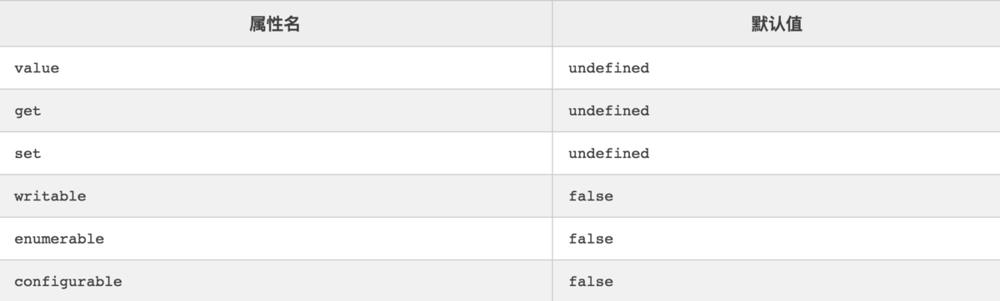

# 对象相关

## 0. 对象属性的描述对象

JavaScript 提供了一个内部数据结构，用来描述对象的属性，控制它的行为，比如该属性是否可写、可遍历等等，这个内部数据结构称为“属性描述对象”（attributes object）。每个属性都有自己对应的属性描述对象，保存该属性的一些元信息。

```js
{
  value: 123,	
  writable: false,
  enumerable: true,
  configurable: false,
  get: undefined,
  set: undefined
}
```

### 6个元属性

#### （1）value：属性值

value是该属性的属性值，默认为undefined。

#### （2）writable：可写性

writable是一个布尔值，表示属性值（value）是否可改变（即是否可写），默认为true。

#### （3）enumerable：可枚举性

enumerable是一个布尔值，表示该属性是否可遍历，默认为true。

如果设为false，会使得某些操作（比如for...in循环、Object.keys()）跳过该属性。

#### （4）configurable：可配置性

configurable是一个布尔值，表示可配置性，默认为true。

如果设为false，将阻止某些操作改写该属性，比如**无法删除该属性，也不得改变该属性的属性描述对象（value属性除外）**。

也就是说，configurable属性控制了属性描述对象的可写性。

#### （5）get

get是一个函数，表示该属性的取值函数（getter），默认为undefined。

#### （6）set

set是一个函数，表示该属性的存值函数（setter），默认为undefined。


**value: 与属性有关的值。可以是任何有效的 javascript 值。默认为 undefined .**

**configureable: 当且仅当这个属性描述符值为 true 时，该属性可能会改变，也可能会被从相应的对象删除。默认为 false .**

**enumerable:  true 当且仅当该属性出现在相应的对象枚举属性中。默认为 false .**

**writable:  true 当且仅当可能用赋值运算符改变与属性相关的值。默认为 false .**


##  Object.defineProperty


### 1）对象的定义与赋值

经常使用的定义与赋值方法`obj.prop =value`或者`obj['prop']=value`


### 2）Object.defineProperty()语法说明

`Object.defineProperty()`的作用就是直接在一个对象上定义一个新属性，或者修改一个已经存在的属性

```js
Object.defineProperty(obj, prop, desc)
```

1. obj 需要定义属性的当前对象
2. prop 当前需要定义的属性名
3. desc 属性描述符

一般通过为对象的属性赋值的情况下，对象的属性可以修改也可以删除，但是**通过Object.defineProperty()定义属性，通过描述符的设置可以进行更精准的控制对象属性。**

### 3）属性的特性以及内部属性

javacript 有三种类型的属性

1. 命名数据属性：拥有一个确定的值的属性。这也是最常见的属性
2. 命名访问器属性：通过`getter`和`setter`进行读取和赋值的属性
3. 内部属性：由JavaScript引擎内部使用的属性，不能通过JavaScript代码直接访问到，不过可以通过一些方法间接的读取和设置。比如，每个对象都有一个内部属性`[[Prototype]]`，你不能直接访问这个属性，但可以通过`Object.getPrototypeOf()`方法间接的读取到它的值。虽然内部属性通常用一个双吕括号包围的名称来表示，但实际上这并不是它们的名字，它们是一种抽象操作，是不可见的，根本没有上面两种属性有的那种字符串类型的属性

### 4）属性描述符

通过Object.defineProperty()为对象定义属性，有两种形式，且不能混合使用，**分别为数据描述符，存取描述符**，下面分别描述下两者的区别：

##### 数据描述符

数据描述符特有的两个属性（ value、writable ）

```js
let Person = {}
Object.defineProperty(Person, 'name', {
   value: 'jack',
   writable: true // 是否可以改变
})

// writable 默认是不可改变的
let Person = {}
Object.defineProperty(Person, 'name', {
   value: 'jack',
})
Person.name = 'Tom'  // 属性赋值不成功
Person.name // 'jack'
```

注意，如果描述符中的某些属性被省略，会使用以下默认规则：




##### 存取描述符

存取描述符 --是由一对 getter、setter 函数功能来描述的属性

`get`：一个给属性提供`getter`的方法，如果没有`getter`则为`undefined`。该方法返回值被用作属性值。默认为`undefined`。
 `set`：一个给属性提供`setter`的方法，如果没有`setter`则为`undefined`。该方法将接受唯一参数，并将该参数的新值分配给该属性。默认值为`undefined`。

```js
let Person = {}
let temp = null
Object.defineProperty(Person, 'name', {
  get: function () {
    return temp
  },
  set: function (val) {
    temp = val
  }
})

```


##### 两者共有的特性

数据描述符和存取描述均具有以下描述符：

1. configrable   描述属性是否配置，以及可否删除
2. enumerable  描述属性是否会出现在for in 或者 Object.keys()的遍历中


### 5）不变性

#### 6）属性定义和属性赋值


## 1. 对象的get、set

 get 和 set 都是 js 内置方法(es5)，用于设置和读取属性值，当这个属性只有 set 方法时，只可写入；当只有 get 方法时，只能够读取的，无法进行更改。

当一个属性设置了 get 和 set 方法，它就是一个访问器属性。

*作用：*
 (1). 在对象内属性嵌套层级过多时，可以直接在对象下读取到对应属性，简化调用；
 (2). 在get时可以任意设置属性名，可以不暴露组件内部属性名。

### 1）实现方法：

#### 直接在对象内实现

```js
let obj = {
  _name: 'Jay',
  _age: 24,
  set name(val) { this._name = val; },
  get age() { return this._age; }
}
```

这里设置了对象 obj 的 name 为存储属性，age 为只读属性

```js
obj.name  // undefined
obj.age  // 24
obj.age = 26;  // 重新赋值 age 无效
obj.age;  // 24
```

#### 使用Object.defineProperty()


